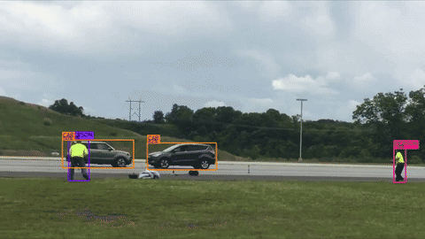

# Civic-Eye

**Real-time computer vision for public safety.** Watches CCTV feeds and shouts only when something genuinely needs a human — traffic accidents, unattended baggage, crowd anomalies — with severity, evidence, and a recommended response attached.

## Demo — tracked output (`car3_tracked.mp4`)

[](docs/demo/car3_tracked.mp4)

*Live preview above (YOLO + ByteTrack boxes with per-track confidence) — click it for the full annotated video.*

## Features

- **Incident detection** — `ACCIDENT` (vehicle collision + speed collapse), `UNATTENDED_BAGGAGE` (stationary bag, owner seen then away), `CROWD_ANOMALY` (abnormal crowd movement, neutral wording — never "panic"/"riot").
- **Anti-false-alarm design** — temporal verification (no single frame ever confirms), proximity-without-corroboration rejection, rider/passenger filtering (bikers and bus passengers aren't a "crowd"), traffic-aware crowd gating (a 20-vehicle jam doesn't page anyone), duplicate-box suppression, end-of-video finalize (clean footage is never flagged "under review").
- **Explainability** — every confirmed incident carries evidence items, confidence, component scores, and human-readable reasons.
- **Live webcam detection** — laptop camera → same pipeline → annotated MJPEG preview + on-screen popup alerts.
- **Dashboard (React)** — command center, live CCTV wall, emergency dispatch queue, incident dossiers, analytics, real-time WebSocket alerts with popup + toast.
- **Multi-camera** — topology, cross-camera correlation (one real-world event = one grouped incident), camera health monitoring.

## Architecture

```
YOLO detection → ByteTrack tracking → Behavioral engine (kinematics per track)
  → Temporal verification (persistence across frames/seconds)
  → Incident intelligence (accident / baggage / crowd assessment)
  → False-alarm suppression (reason-coded, nothing silently dropped)
  → Severity + response recommendation → Lifecycle state machine
  → SQLite persistence + EventBus → WebSocket → Dashboard + alert popups
```

**Lifecycle:** `DETECTED → VERIFYING → CONFIRMED → DISPATCHED → RESOLVED`, with `VERIFYING → FALSE_ALARM` as the alternative. Invalid transitions are rejected (HTTP 409).

**Confidence** is a deterministic weighted blend of evidence scores + temporal persistence + cross-signal agreement, clamped to [0, 1] — a confidence *score*, never a calibrated probability. Speeds are pixel-space (no km/h claims).

## Pipeline (per video job)

```
VideoReader → FrameProcessor (class filter, track-age gating)
  → BehaviorEngine (sudden-stop, trajectory, stationary, collision, crowd)
  → IncidentEngine (temporal verify → assess → suppress → confirm)
  → annotated video + events.jsonl / behavior_events.jsonl / incidents.jsonl
  → SQLite rows + bus events + multi-camera fusion
```

## Quick start

**Backend** (FastAPI, `http://localhost:8000`, docs at `/docs`):

```powershell
python -m venv .venv
.venv\Scripts\activate
pip install -r backend/requirements.txt
cd backend
uvicorn app.main:app --reload
```

**Frontend** (React + Vite):

```powershell
cd frontend
npm install
npm run dev
```

A `.env` file is optional — sane defaults apply (see `backend/.env.example`).

## Demo walkthrough

1. **Upload a video** — Live Cameras → Upload → pick an `.mp4` file (uploads straight to the backend, ≤200 MB) → Start Processing → preview + download the tracked video + "why this verdict" explanation. Advanced fallback: paste a server-side path under `backend/` instead of picking a file.
2. **Live webcam** — start the backend, then:
   ```powershell
   Invoke-RestMethod -Method Post http://localhost:8000/api/v1/processing/camera/start `
     -ContentType 'application/json' -Body '{"camera_id": "CAM-LIVE", "source": 0, "fps": 10}'
   ```
   Watch `http://localhost:8000/api/v1/processing/camera/stream` in a browser; stop with `POST /api/v1/processing/camera/stop`. `source` also accepts an RTSP URL or video file.
3. **Alerts** — confirmed collisions / baggage raise an on-screen popup (view → dossier, or dismiss) plus Emergency queue entries.
4. **Demo login** (frontend mock auth) — email `traffic.police@civiceye.demo`, password `Traffic@2026`.

## API endpoints (`/api/v1`)

| Method | Path | Description |
|--------|------|-------------|
| GET | /health | Liveness probe |
| GET/POST | /cameras, /cameras/topology, /cameras/health | Registry, topology, health |
| GET | /incidents, /incidents/active, /incidents/{id} (+/evidence, /history) | List, detail, evidence |
| POST | /incidents/{id}/dispatch, /incidents/{id}/resolve | Lifecycle transitions |
| POST / GET | /processing/video, /processing/upload, /processing/{job_id}(/video, /incidents, /explanation) | File jobs (path or direct upload) + verdict |
| POST/GET | /processing/camera/start, /stop, /status, /snapshot, /stream | Live webcam |
| GET | /dashboard/snapshot, /events/recent | Dashboard data |
| WS | /ws | Live event envelopes (`INCIDENT_CONFIRMED`, …) |

## Configuration highlights (`backend/.env`)

| Key | Meaning |
|-----|---------|
| `AI_CONFIDENCE_THRESHOLD`, `AI_MIN_TRACK_AGE` | Detection bar, flicker gating |
| `CROWD_MIN_PERSONS`, `CROWD_DISPERSION_THRESHOLD` | Crowd sensitivity |
| `ACCIDENT_CONFIRMATION_THRESHOLD` (0.55) | Accident confirm bar |
| `BAGGAGE_STATIONARY_SECONDS` | Unattended-bag stillness |
| `LIVE_CAMERA_FPS`, `LIVE_JPEG_QUALITY` | Live analysis rate / preview quality |

## Testing

```powershell
cd backend
pytest            # 280+ tests: behavior, intelligence, API, live stream
```

```powershell
cd frontend
npx tsc --noEmit  # typecheck
```

## Project structure

```
Civic-Eye/
├── backend/app/
│   ├── ai/            # YOLO detector, ByteTrack tracker, inference facade
│   ├── behavior/      # kinematics, trajectory, stationary, collision, crowd
│   ├── intelligence/  # temporal verifier, accident/baggage/crowd, severity,
│   │                  # response, lifecycle, false-alarm, fusion, persistence
│   ├── pipeline/      # video reader, frame processor, job manager, live stream
│   ├── api/           # health, cameras, incidents, analytics, processing, ws
│   ├── events/        # in-process event bus + websocket manager
│   └── main.py        # FastAPI entry point
├── frontend/src/      # pages, CCTV wall, emergency, map, alerts, stores
├── docs/demo/         # demo video + thumbnail (tracked output sample)
└── data/videos/sample/# local-only sample footage (gitignored, never pushed)
```
